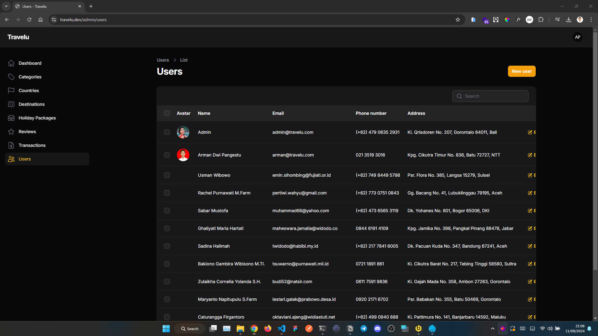
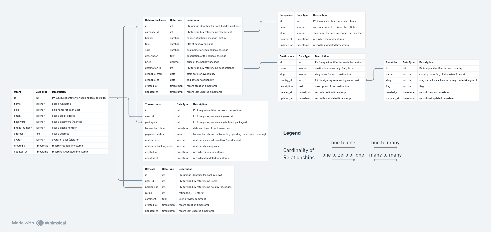

<h1 align="center">Travelu</h1>

<div align="center">

&nbsp;
&nbsp;
&nbsp;

</div>



<p align="center">This repository is web application that aims to provide features such as CMS (Content Management System) for creating holiday package content. This app is built using Laravel, Filament, Docker, Nginx</p>

## Table of Contents

-   [Tech Stack](#tech-stack)
-   [Entity Relationship Diagram](#entity-relationship-diagram-erd)
-   [Running on Localhost](#running-on-localhost)
    -   [Clone this repository](#clone-this-repository)
    -   [Copy & fill .env](#copy--fill-env)
    -   [Application URL](#application-url)
    -   [Database Configuration](#database-configuration)
    -   [Install dependency package](#install-dependency-package)
    -   [Generate key](#generate-key)
    -   [Running the migration and seeder](#running-the-migration-and-seeder)
    -   [Running the application](#running-the-application)
-   [Deployment](#deployment)
    -   [Container (Docker Compose)](#container-docker-compose)
        -   [Setup Docker](#setup-docker)
        -   [Setup .env before build the image](#setup-env-before-build-the-image)
        -   [Build and run the container](#build-and-run-the-container)
        -   [Setup container app (laravel)](#setup-container-app-laravel)
    -   [Running on Host or Virtual Private Server (VPS)](#running-on-host-or-virtual-private-server-vps)
        -   [Update Repository & Upgrade Package](#update-repository--upgrade-package)
        -   [Install necessary package](#install-necessary-package)
        -   [Install composer](#install-composer)
        -   [Configure MariaDB](#configure-mariadb)
        -   [Configure Laravel](#configure-laravel)

## Tech Stack

-   [Laravel](https://laravel.com) (`Framework`): Laravel is a PHP framework designed for web development with an expressive and elegant syntax. It provides a comprehensive ecosystem with features such as routing, sessions, caching, and authentication, enabling developers to build robust and scalable web applications easily.
-   [Filament](https://filamentphp.com) (`Full-stack components`): A collection of beautiful full-stack components. The perfect starting point for your next app.
-   [Docker](https://www.docker.com/) (`Container`): Docker is a platform designed to help developers build, share, and run container applications. We handle the tedious setup, so you can focus on the code.
-   [Nginx](https://nginx.org/en/) (`Web Server`): Nginx is a web server that can also be used as a reverse proxy, load balancer, mail proxy and HTTP cache.

## Entity Relationship Diagram (ERD)



## Running on Localhost

### Clone this repository

> [!TIP]
> If you are using Laragon or XAMPP you can specify the clone directory destination to your `www` or `htdocs`, for example
>
> ```bash
> git clone https://github.com/armandwipangestu/travelu.git Z:/laragon/www/travelu && cd travelu
> ```
>
> or
>
> ```bash
> git clone https://github.com/armandwipangestu/travelu.git C:/xampp/htdocs/travelu && cd travelu
> ```
>
> But if you just running using php web server you can place the clone directory anywhere

```bash
git clone https://github.com/armandwipangestu/travelu.git && cd travelu
```

### Copy & Fill .env

```bash
cp .env.example .env
```

After `.env.example` copied to `.env` now fill with your own configuration at this variable

### Application URL

You can change this `APP_URL` variable with your own configuration, for example if I running with laragon, I use pretty url which is will create a Virtual Host and mapping the local domain to the web server like `https://travelu.dev`.

If you running with the php web server you can just edit this variable with this value `http://localhost:8000`

```bash
APP_URL=http://localhost
```

### Database Configuration

```bash
DB_CONNECTION=mysql
DB_HOST=127.0.0.1
DB_PORT=3306
DB_DATABASE=travelu
DB_USERNAME=root
DB_PASSWORD=
```

### Install dependency package

```bash
composer install
```

### Generate key

```bash
php artisan key:generate
```

### Running the migration and seeder

```bash
php artisan migrate:fresh --seed
```

### Running the application

> [!IMPORTANT]
> If you are using laragon pretty url like me, you can skip this part because it already running on local domain because virtual host. But this part will be use for the port forwarding (ngrok or vscode) and testing midtrans payment

```bash
php artisan serve
```

Now you can access the application on `http://localhost:8000`

## Deployment

> [!NOTE]
> In this deployment I'm using VPS Ubuntu 24.04 LTS on Google Compute Engine. We need to clone the repository before all of the process
>
> ```bash
> git clone https://github.com/armandwipangestu/travelu.git ~/travelu
> ```

1. First you need to have a web server (I'm using nginx) as a front server, the nginx will forward traffic or pass to process manager php-fpm with fastcgi.

2. You can install nginx latest version with this command:

-   Add GPG

```bash
curl https://nginx.org/keys/nginx_signing.key | gpg --dearmor \
    | sudo tee /usr/share/keyrings/nginx-archive-keyring.gpg >/dev/null
```

-   Add nginx repository

```bash
echo "deb [signed-by=/usr/share/keyrings/nginx-archive-keyring.gpg arch=amd64] \
http://nginx.org/packages/ubuntu `lsb_release -cs` nginx" \
    | sudo tee /etc/apt/sources.list.d/nginx.list
```

-   Update and install nginx

```bash
sudo apt update && sudo apt install nginx
```

3. Setup SSL with Let's encrypt (this is optional, if you want to running with just http you can skip this part)

-   Install snap

```bash
sudo apt install snapd && sudo snap install core && sudo snap refresh core
```

-   Install certbot

```bash
sudo snap install --classic certbot
```

-   Create a symlink for certbot binary

```bash
sudo ln -s /snap/bin/certbot /usr/bin/certbot
```

-   Generate SSL Certificate

> [!NOTE]
> Change the `DOMAIN` variable with your own configuration, you can fill with domain or subdomain. For example `travelu.com` or `travelu.example.com`

The SSL Certificate will stored at `/etc/letsencrypt/live`

```bash
DOMAIN="travelu.com"
sudo certbot certonly --standalone --agree-tos --no-eff-email --staple-ocsp --preferred-challenges http -m noreply@${DOMAIN} -d ${DOMAIN} --pre-hook="systemctl stop nginx" --post-hook="systemctl start nginx"
```

-   Improve SSL security exchanges by creating a Diffle-Helman exchange key

```bash
sudo openssl dhparam -out /etc/ssl/certs/dhparam.pem 2048
```

-   Update nginx configuration

> [!NOTE]
> Choose what your laravel deployment type:
>
> 1. Running on host (VPS): If your deployment this type, the nginx configuration at `~/travelu/nginx/pass-to-host`
> 2. Container (docker compose): If your deployment this type, the nginx configuration at `~/travelu/nginx/pass-to-container`

You can update nginx configuration on file `travelu-ssl.conf` or `travelu.conf` (if you running with http), then update the domain name `travelu.com` with your own domain. For example I will choose container deployment with https

```bash
nvim ~/travelu/nginx/pass-to-container/travelu-ssl.conf
```

-   Check nginx configuration

Make sure the nginx configuration content have this configuration `include /etc/nginx/sites-enabled/*;`. If not you can manually add

```bash
cat /etc/nginx/nginx.conf
```

-   Copy the nginx configuration to `/etc/nginx/sites-available`

Now copy the nginx configuration, for example I will choose container deployment with https

```bash
sudo cp ~/travelu/nginx/pass-to-container/travelu-ssl.conf /etc/nginx/sites-available
```

-   Create a symlink nginx configuration to `/etc/nginx/sites-enabled`

Now create the symlink to enable the configuration

```bash
sudo ln -s /etc/nginx/sites-available/travelu-ssl.conf /etc/nginx/sites-enabled/travelu-ssl.conf
```

After create a symlink, you can check the nginx configuration with this command

```bash
sudo nginx -t
```

-   Restart the nginx service

> [!NOTE]
> Sometimes the nginx got error permission denied to `php8.3-fpm.sock` if your deployment running on host, to fix this you can add uncomment this configuration at `/etc/php/8.3/fpm/pool.d/www.conf`
>
> ```conf
> listen.owner = www-data
> listen.group = www-data
> listen.mode = 0660
> ```
>
> then add permission for user `www-data` to `nginx` group
>
> ```bash
> sudo usermod -aG www-data nginx
> ```
>
> Now restart the service
>
> ```bash
> sudo service php8.3-fpm restart
> ```

```bash
sudo systemctl restart nginx
```

### Container (Docker Compose)

#### Setup Docker

1. Add docker repository

```bash
curl -fsSL https://download.docker.com/linux/ubuntu/gpg | sudo gpg --dearmor -o /usr/share/keyrings/docker-archive-keyring.gpg
echo "deb [arch=$(dpkg --print-architecture) signed-by=/usr/share/keyrings/docker-archive-keyring.gpg] https://download.docker.com/linux/ubuntu $(lsb_release -cs) stable" | sudo tee /etc/apt/sources.list.d/docker.list > /dev/null
```

2. Install docker package

```bash
sudo apt update && apt-cache policy docker-ce && sudo apt install docker-ce
sudo systemctl status docker
```

3. Add current user to docker group

> [!NOTE]
> This setup will make your current user can run docker without `sudo` command

```bash
sudo usermod -aG docker ${USER} && su - ${USER}
```

4. Install docker compose

```bash
sudo apt update && sudo apt install docker-ce-cli containerd.io docker-compose-plugin docker-compose
docker compose version
```

#### Setup .env before build the image

> [!NOTE]
> You must be setup your `.env`, you can refer with the localhost setup

```bash
cd ~/travelu
cp .env.example .env
```

#### Build and run the container

```bash
docker compose up --build -d
```

#### Setup container app (laravel)

1. Install dependency package

```bash
docker compose exec app composer install
```

2. Generate key

```bash
docker compose exec app php artisan key:generate
```

3. Running the migration and seeder

```bash
docker compose exec app php artisan migrate:fresh --seed
```

4. Create symbolic link for `/storage/app/pubic` to `/public`

```bash
docker compose exec app php artisan storage:link
```

Now you can access the application with your own domain

> [!NOTE]
> If you got an error because permission denied at directory `/var/www/travelu/storage` and `/var/www/travelu/bootstrap/cache`. You can run this command
>
> ```bash
> docker compose exec app chown -R www-data:www-data /var/www/travelu/storage
> docker compose exec app chown -R www-data:www-data /var/www/travelu/bootstrap/cache
> ```

### Running on Host or Virtual Private Server (VPS)

#### Update Repository & Upgrade Package

```bash
sudo apt update && sudo apt upgrade
```

#### Install necessary package

```bash
sudo apt install php-mbstring php-xml php-bcmath php-curl php-cli php-fpm php-mysql php-intl php-zip unzip mariadb-server
```

#### Install composer

```bash
curl -sS https://getcomposer.org/installer -o /tmp/composer-setup.php
HASH=`curl -sS https://composer.github.io/installer.sig` && echo $HASH
php -r "if (hash_file('SHA384', '/tmp/composer-setup.php') === '$HASH') { echo 'Installer verified'; } else { echo 'Installer corrupt'; unlink('composer-setup.php'); } echo PHP_EOL;"
sudo php /tmp/composer-setup.php --install-dir=/usr/local/bin --filename=composer
```

#### Configure MariaDB

1. Change default password for root user

```bash
sudo mariadb -u root -p
```

```sql
ALTER USER 'root'@'localhost' IDENTIFIED BY 'your_secure_password';
FLUSH PRIVILEGES;
```

2. MariaDB secure installation

```bash
mariadb-secure-installation
```

3. Create new database and user

```bash
sudo mariadb -u root -p
```

```sql
CREATE database travelu;
CREATE USER user_travelu IDENTIFIED BY 'your_secure_password';
GRANT ALL PRIVILEGES ON `travelu`.* TO `user_travelu`@`%`;
FLUSH PRIVILEGES;
```

#### Configure Laravel

1. Install laravel dependency

> [!NOTE]
> You must be setup your `.env`, you can refer with the localhost setup

```bash
cd ~/travelu && composer install
```

2. Generate key

```bash
php artisan key:generate
```

3. Running the migration and seeder

```bash
php artisan migrate:fresh --seed
```

4. Create symbolic link for `/storage/app/pubic` to `/public`

```bash
php artisan storage:link
```

5. Copy or move project to `/var/www/travelu`

```bash
sudo cp -R ~/travelu /var/www/travelu
```

6. Change the user and group owner permission to `www-data`

```bash
sudo chown -R www-data:www-data /var/www/travelu
```

7. Change the permission mode for `storage` and `bootstrap/cache` folder

```bash
sudo chmod -R 755 /var/www/travelu/storage
sudo chmod -R 755 /var/www/travelu/bootstrap/cache
```

Now your application has been running.
